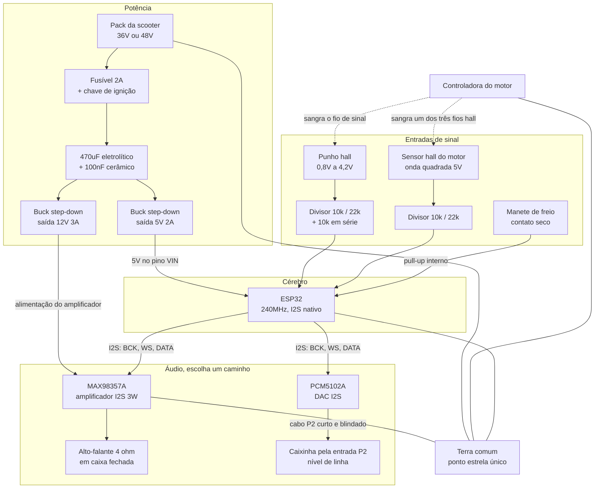

# Circuito do módulo de som

Diagrama de ligação para o módulo de som de motor em scooter elétrica, com ESP32.
Duas saídas de áudio alternativas: alto-falante próprio ou entrada P2 da caixinha.

## Pinos do ESP32

| Função | Pino | Observação |
|---|---|---|
| Punho, leitura analógica | GPIO34 | ADC1, só entrada, sem pull-up interno |
| Pulso do hall do motor | GPIO35 | ADC1, interrupção por borda |
| Manete de freio | GPIO27 | pull-up interno, ativo em nível baixo |
| I2S bit clock | GPIO26 | |
| I2S word select | GPIO25 | |
| I2S data out | GPIO22 | |
| Potenciômetro de volume | GPIO32 | opcional, ADC1 |

Use apenas pinos do ADC1, que são GPIO32 a GPIO39. O ADC2 fica inutilizável
quando o WiFi está ativo, e vários projetos usam WiFi para a página de configuração.

## O que não pode dar errado

**Divisor de tensão obrigatório.** O ADC do ESP32 lê até 3,3V. Com 10k em série
e 22k para o terra, um sinal de 4,2V chega em 2,89V. Margem suficiente sem
perder resolução.

**Resistor de 10k em série no fio do punho.** Se esse fio encostar no positivo
ou no terra, a controladora interpreta como acelerador no fundo ou como falha
de sensor. O resistor transforma um curto em uma leitura errada inofensiva.

**Não alimente o ESP32 pelo 5V do punho.** Essa linha é a referência de tensão
da controladora e é fraca. Buck separado, direto do pack.

**Terra comum em ponto estrela.** Um único ponto de junção. Terra em malha,
com o motor puxando corrente alta, injeta ruído audível direto no amplificador.

**Filtro na entrada do buck.** A controladora de BLDC chaveia em alguns kHz e
joga isso de volta na linha. Sem o eletrolítico de 470uF, você ouve o motor
elétrico chiando por dentro do som do motor a combustão.

**Opcional, mas recomendado:** optoacoplador no sinal do hall do motor, no lugar
do divisor. Isola o ESP32 da controladora por completo. Custa um 4N25 e dois
resistores.

## Se o motor for sensorless

Sem hall interno, use um A3144 apoiado no garfo e quatro a seis ímãs de
neodímio nos raios ou no disco de freio. Não use um ímã só: com um pulso por
volta a leitura fica lenta e granulada em velocidade de caminhada, exatamente
onde você mais precisa de resolução.
